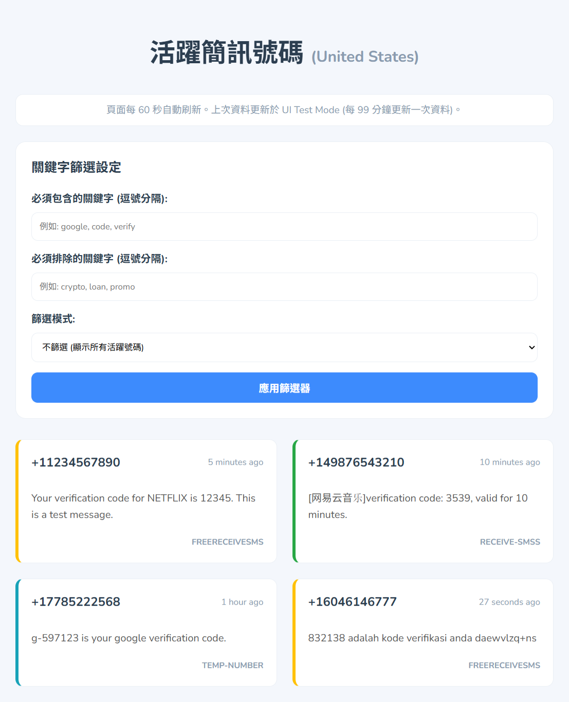

# **臨時簡訊接收號碼監控器**
(Temporary SMS Receiver Monitor)
---

<div align="center">


</div>


<p align="center">  
<a href="./README.en.md"><strong>English</strong></a> •  
<strong>繁體中文</strong>  
</p>

這個專案是一個 Python 應用程式，用於爬取特定網站上的臨時簡訊接收號碼，並利用 **Selenium** 繞過反爬蟲機制，同時使用 **執行緒池 (ThreadPoolExecutor)** 併發檢查多個號碼頁面，以找出最近一小時內有收到新簡訊的「活躍號碼」。



它提供兩種執行模式：

1. **本地執行 (main.py)**: 適合在本機電腦上運行，可選是否使用 ngrok 建立公開網址。  
2. **Colab 執行 (main.py --ngrok_token $ng_token)**: 專為 Google Colaboratory 設計，方便在雲端環境中運行並透過 ngrok 快速建立公開網址。

## **🚀 專案設置 (Setup)**

### **1\. 先決條件 (Prerequisites)**

* Python 3.10 或更高版本。  
* uv (推薦的 Python 包管理器) 或 pip。  
* Google Chrome 瀏覽器 (用於本地執行)。  
* [ngrok Authtoken](https://dashboard.ngrok.com/get-started/your-authtoken) (用於建立公開網址，非必要但推薦)。

### **2\. 安裝依賴項 (Install Dependencies)**

專案使用 pyproject.toml 管理依賴。請使用 uv sync 或 pip install \-r requirements.txt (如果已生成) 來安裝。

`uv sync`

或  

`pip install beautifulsoup4 flask pyngrok requests selenium tomli waitress webdriver-manager`

### **3\. 配置檔案 (config.toml)**

請根據您的需求編輯 config.toml 檔案：

| 設定項目 | 說明 |
| :---- | :---- |
| ngrok\_auth\_token | 您的 ngrok 金鑰。若在 Colab 中執行，此項可留空，透過命令行傳入。 |
| country\_code | 要搜尋的國家/地區代碼 (例如: us, ca, gb)。 |
| cache\_duration\_seconds | 爬蟲背景更新資料的間隔時間（預設 300 秒，即 5 分鐘）。 |
| max\_workers | 併發檢查號碼時使用的最大執行緒數。 |

## **💻 執行指南 (Execution Guide)**

### **模式一：本地執行 (Local Execution)**

使用 main.py 在您的本機電腦上執行。

#### 運行主程式  
`uv sync`

`uv run main.py`

* 如果 config.toml 中的 ngrok\_auth\_token 是**空字串**，程式將以本地模式啟動，您只能透過 http://127.0.0.1:5000 訪問。  
* 如果 ngrok\_auth\_token **已設定**，程式將同時啟動 Flask 服務和 ngrok 公開網址。

### **模式二：Colab/公開執行 (Colab/Public Execution)**

<a href="https://colab.research.google.com/github/LayorX/Temporary-SMS-Receiver-Monitor/blob/master/Temporary_SMS_Receiver_Monitor.ipynb" target="_blank"></a>

[快速簡單執行Colab](/Temporary_SMS_Receiver_Monitor.ipynb)

使用 `!uv run python main.py --ngrok_token $ng_token` 專門在雲端環境中執行，它包含從命令行讀取 ngrok Token 的邏輯。
#### 全部執行
**Colab 步驟:**

1. 將您的 ngrok Authtoken 儲存到 Colab 的 Secrets Manager (密鑰管理器) 中，命名為 NGROK\_AUTH\_TOKEN。  
2. 在 Colab 筆記本中，Run all：


---

#### 自行執行
```
# 最安全方法還是在Secrets Manager 中，配置您的 ngrok NGROK_AUTH_TOKEN
NGROK_AUTH_TOKEN = "" # @param {"type":"string","placeholder":"NGROK_AUTH_TOKEN"}

!git clone https://github.com/LayorX/Temporary-SMS-Receiver-Monitor.git
%cd Temporary-SMS-Receiver-Monitor
# 更新套件列表 / Update package list
!apt-get update

# 下載 Google Chrome 穩定版安裝檔 / Download the stable version of the Google Chrome installer
!wget https://dl.google.com/linux/direct/google-chrome-stable_current_amd64.deb

# 安裝 .deb 檔案，並修復相依性問題 / Install the .deb file and fix dependency issues
!apt install --fix-broken -y ./google-chrome-stable_current_amd64.deb

from google.colab import userdata
from google.colab.userdata import NotebookAccessError,SecretNotFoundError

try:
  print("【NGROK_AUTH_TOKEN】: Secrets Manager")
  ng_token = userdata.get("NGROK_AUTH_TOKEN")
except (NotebookAccessError, SecretNotFoundError):
  print("【NGROK_AUTH_TOKEN】: Google Colab Code Block")
  ng_token = NGROK_AUTH_TOKEN

!uv sync
!uv run python main.py --ngrok_token $ng_token
```

## **💡 優化分析總結 (Optimization Summary)**

| 項目 | 原始程式碼 (main.py) | 優化後的程式碼 (已修訂) | 效益 |
| :---- | :---- | :---- | :---- |
| **結構重複** | 兩個檔案高度重複。 | 結構分離但核心邏輯相同（保留分離以適應不同啟動方式）。 | **清晰度維持**，未來可進一步重構。 |
| **爬蟲效能** | 在每個執行緒中重複呼叫 ChromeDriverManager().install()。 | **將 ChromeDriverManager().install() 移至主程式啟動區塊，僅執行一次。** | **極大提升啟動速度和爬蟲效率**，避免數十次重複的驅動程式檢查和設定。 |
| **WebDriver** | 每個檢查任務啟動一個獨立的瀏覽器實例。 | 保持現有設計，但共用單一 Service 實例。 | 這是 Selenium 併發的標準模式，但應留意 **MAX\_WORKERS** 的設定，數值過高仍可能耗盡系統資源。 |

優化後的程式碼主要解決了 **WebDriver 驅動程式的重複安裝問題**，這是在使用 Selenium 進行併發爬蟲時最常見且影響最大的效能瓶頸。

## **💖 歡迎貢獻 (Contributing)**

這個專案是開源的，我們非常歡迎任何形式的貢獻！**無論您是經驗豐富的開發者，還是剛入門的新手，都歡迎您一起加入，讓這個工具變得更好！**

### [**👉貢獻**](./CONTRIBUTING.md) 


我們將會盡快 review 您的貢獻。感謝所有為這個專案付出時間和精力的開發者！

## **📄 授權 (License)**

本專案採用 [MIT License](./LICENSE) 授權。